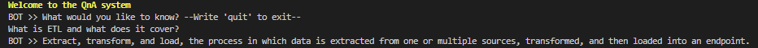

# BlogQnA

A simple yet effective Question and Answering system for blog posts on a website, aimed at improving user engagement and providing helpful responses to inquiries.

## Overview

This system can be tested as a main console application built to interact with the trained model and get the blogpost related questions.

The current application will require of three steps:

1. Scrapping training data.
2. Training the GPT model.
3. Testing the model as a console application.

## Setup

Create a new python requirement with `python3 -m venv env`

Install the dependencies by running `pip install -r requirements.txt`

## Scrapping the training data

We will use blogposts content used to build the `data/blogposts.txt` file used for training, this content will be generated from the scraper script: `python scrapper --posts 20` where posts is the number of post to include from 'https://improvado.io'.

## Training the GPT model

The create a new model run the training script with: `python train_model.py --epochs 20`, the model will start downloading the pretrained model, will continue the fine-tunning process and then save it together with the tokenizer on the `models/` folder. The number of **epochs** involves more training time and may lead to increase the model perfomance.

Add the `--gpu` flag to `python train_model.py` for training on gpu.

The training process could long and a good way to train the model using gpu is with google colab, I have adapted the training process in the following notebook using gpu: `url`, at the end the model can be dowloaded and moved to the `models` folder.

I have fine-tunned a model with the first 20 blogposts and 20 epochs, this is available here: `url` 

## Test the console application

The console application can be tested by running: `python main.py`, example:  

## Model evaluation

To evaluate the model answers a script was added with the metric...

## Future improvements

- The `DialoGPT` model is very good, but to get better results, we could train different GPT models and create a benchmark. By designing better analytics, we can select the best model.
- The scrapper results could be improved gathering the related paragraph for better concept learning.
- The current console application manage a single input question like an interactive FAQ, for a better conversation and memory we could save the previous question and answers and pass it like a context to the model.
